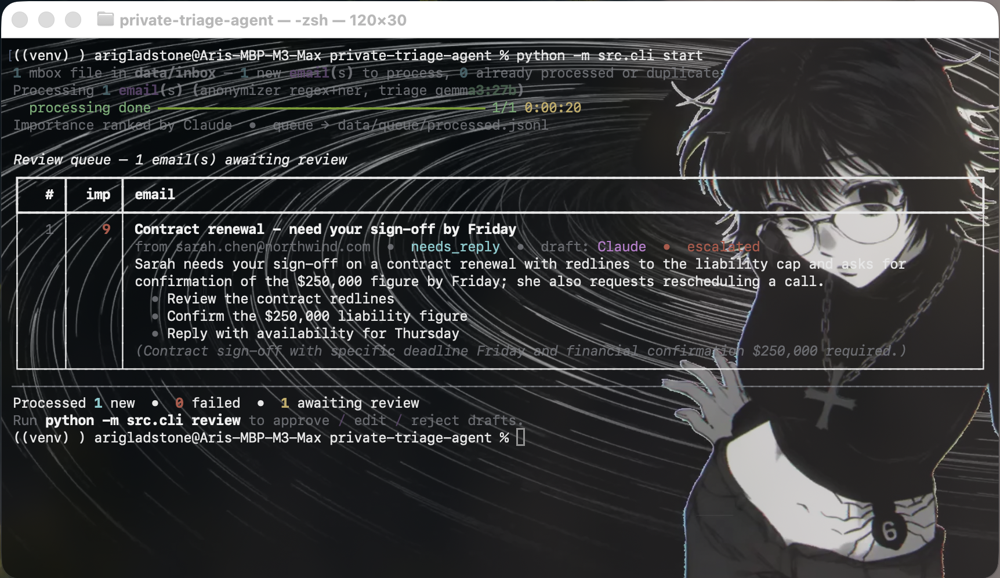

# private-triage-agent

A privacy-preserving email triage agent. A local model (`gemma3:27b` via Ollama) handles most processing; sensitive content is anonymized before being sent to the Claude API for harder reasoning, then re-hydrated locally.




## What it does

The local model triages every email: category, summary, action items, a reply
draft. When it's uncertain or the content looks sensitive (legal, negotiation,
dollar figures), the email is **anonymized**, sent to Claude for a stronger
draft, then **re-hydrated** locally. Nothing is sent automatically: every draft
is reviewed by you first. 

Under the hood, it runs three sequential layers, each covering a failure mode the
others structurally miss. The default (`combined`) runs all three; you can
select a single layer with `--anonymizer`.

- **Deterministic regex** for fixed-shape PII: emails, phone numbers, dollar
  amounts, dates. Fast and exact, but can't work on anything without a predictable
  pattern.
- A **spaCy transformer NER pipeline** (`en_core_web_trf`, a RoBERTa-based
  model) that reads each sentence and tags the open-ended proper nouns: people (`PERSON`), organizations (`ORG`), locations
  (`GPE`), and facilities (`FAC`). This is what turns `Sarah` into `Alex_P1`
  and `Northwind` into `Acme_O1`. NER runs on the regex-anonymized text, so the
  cheap exact patterns clean up first.
- **Neural coreference resolution** (fastcoref's `biu-nlp/f-coref` model) that
  links every pronoun back to the entity it refers to. Coref predicts mention
  clusters, every span that points to the same entity, returned as character
  offsets, so "Sarah," "she," and "her" come back as one chain. Each pronoun
  then inherits its placeholder from that cluster and the model finds the mention
  in the chain that overlaps an entity NER already tagged (`Sarah → Alex_P1`)
  and rewrites every other mention in the chain to the same `Alex_P1`. This
  offset-based linking lets a bare "she" three sentences later resolve
  to the correct person rather than just being a generic redaction. Pronouns aren't named
  entities, so NER can't touch them; only the coref chain can.
  `scripts/eval_pronoun_leak.py` measures how many such leaks slip through with
  and without this layer. (`en_coreference_web_trf`, spaCy's own experimental
  coref, doesn't work on Apple Silicon rn, which is why fastcoref is used
  here.)

The three passes run in sequence on progressively cleaner text. When the
layers flag overlapping spans, the longest match wins, and replacements are
applied right-to-left so earlier character offsets stay valid as later ones are
rewritten. Every entity maps to a stable, proper-noun-shaped placeholder
(`Alex_P1`, `Acme_O1`, `Amount_M1`).
On escalation, Claude sees these as in-distribution proper nouns rather than
opaque redactions, and its system prompt instructs it to copy every placeholder
back verbatim, so local re-hydration can reverse the exact same mapping after
Claude responds. Because coreference models are imperfect, a held-out eval
harness reports the residual PII leak rate per layer.


You work in two steps. `start` processes new emails and prints an
importance-ranked summary of what's waiting. `review` then walks through those drafts
one by one so you can approve, edit, or reject each one.

```sh
python -m src.cli start    # process all new mail, rank by importance
python -m src.cli review   # approve / edit / reject, most important first
```
Here's one example of an email going through the pipeline.

**1. Incoming email**

```
Subject: Contract renewal - need your sign-off by Friday
From: sarah.chen@northwind.com

Following up on the Northwind service contract. Legal flagged two changes to the
liability cap and we should push back before signing. Can you review the redlines
and confirm the $250,000 figure before Friday?

Also - can we move our call to Thursday? Reach me at (415) 555-0182.
```

**2. Local triage** (`gemma3:27b`) - never leaves your machine

```
category    : action_required   (confidence 0.85)
action items:
  - Review the contract redlines
  - Confirm the $250,000 figure
  - Reschedule the call
```

The legal redlines and the dollar figure make this a candidate for escalation.

**3. Anonymized before delegation** - this is all Claude sees

```
Subject: Contract renewal - need your sign-off by Date_D1
From: Email_E1

Following up on the Acme_O1 service contract. Legal flagged two changes to the
liability cap and we should push back before signing. Can you review the redlines
and confirm the Amount_M1 figure before Date_D1?

Also - can we move our call to Date_D2? Reach me at Phone_F1.
```

PII becomes proper-noun-shaped placeholders; the mapping stays local:
`Email_E1 → sarah.chen@northwind.com`, `Acme_O1 → Northwind`,
`Amount_M1 → $250,000`, `Phone_F1 → (415) 555-0182`, `Date_D1 → Friday`,
`Date_D2 → Thursday`, `Alex_P1 → Sarah`.

**4. Claude's draft, re-hydrated locally** - placeholders swapped back, ready for review

```
Hi Sarah,

Thanks for the heads up. I'll review the redlines and liability cap changes today
and get back to you on the $250,000 figure by end of business tomorrow.

Thursday works for my schedule. I'll give you a call at (415) 555-0182 to confirm
timing.
```

## Layout

- `src/ingestion/` - loaders for `.mbox` files and read-only IMAP
- `src/triage/` - local model classification and drafting
- `src/anonymize/` - regex / NER / coref anonymizers, mapping store, re-hydration
- `src/router/` - sensitivity scoring, escalation logic, importance ranking
- `src/delegate/` - Claude API client
- `src/review_queue.py` - append-only processed/reviewed ledgers behind `start` + `review`
- `src/eval/` - evaluation harness and leak detector
- `tests/` - pytest tests
- `data/` - gitignored: corpora, the `inbox/` mbox folder, `queue/` ledgers, approved drafts
- `configs/` - YAML config files

## Setup

Requires Python 3.12+ and [Ollama](https://ollama.com/) installed locally with `gemma3:27b` pulled.


`ollama pull gemma3:27b` (~17 GB)

```sh
make install            # create venv, install requirements, download spaCy model
ALLOW_RECENT_PACKAGES=1 make install            #i put a min package date lock to be extra safe but you can bypass it with this command if you need to
cp .env.example .env    # fill in ANTHROPIC_API_KEY
```
make install builds the venv with python3.12 by default. If that exact
executable isn't on your PATH, point it at your interpreter, e.g.
make install PYTHON_BIN=python3 (must be Python 3.12+).

## Usage: start + review (the main pipeline)

```sh
source venv/bin/activate

# 1. Process everything new in data/inbox (the default folder)
python -m src.cli start

# 2. Review the queue interactively, most important first
python -m src.cli review
```

`start` scans a folder of `.mbox` files (default `data/inbox/`, or pass a
path: `start path/to/folder`) and processes every email it hasn't seen
before: triage locally, score sensitivity, and for escalations anonymize,
send to Claude, and rehydrate. 

```
⠧ Re: 3/13 Checkout ━━━━━━━━╸─────────────── 12/47 0:03:12
```

It then ranks the batch by importance with a single Claude call (the digest
payload is anonymized before it leaves the box, and Claude's per-email
reasons are rehydrated locally) and prints a summary table of every pending
email's summary + action items, most important first:

```
Review queue - 3 email(s) awaiting review
┏━━━━━┳━━━━━━┳━━━━━━━━━━━━━━━━━━━━━━━━━━━━━━━━━━━━━━━━━━━━━━━━━━━━━━━━━━━━━━━┓
┃   # ┃  imp ┃ email                                                         ┃
┡━━━━━╇━━━━━━╇━━━━━━━━━━━━━━━━━━━━━━━━━━━━━━━━━━━━━━━━━━━━━━━━━━━━━━━━━━━━━━━┩
│   1 │    9 │ Contract renewal - need your sign-off by Friday               │
│     │      │ from sarah.chen@northwind.com  •  action_required  •  draft:  │
│     │      │ Claude  •  escalated                                          │
│     │      │ Sarah Chen needs the Northwind contract redlines reviewed and │
│     │      │ the $250,000 figure confirmed before Friday.                  │
│     │      │   • Review the contract redlines                              │
│     │      │   • Confirm the $250,000 figure                               │
│     │      │ (Legal redlines plus a hard Friday deadline; needs a prompt   │
│     │      │ reply.)                                                       │
├─────┼──────┼───────────────────────────────────────────────────────────────┤
│   2 │    5 │ Lunch Thursday?                                               │
│     │      │ from vivian@example.com  •  needs_reply  •  draft: local      │
│     │      │ Vivian is asking whether you're free for lunch on Thursday.   │
│     │      │   • Reply with your availability                              │
│     │      │ (Routine scheduling; reply when convenient.)                  │
├─────┼──────┼───────────────────────────────────────────────────────────────┤
│   3 │    2 │ Weekly newsletter                                             │
│     │      │ from news@example.com  •  fyi  •  draft: local                │
│     │      │ …                                                             │
```

`review` walks through every processed-but-unreviewed email in that order: approve /
edit / reject each draft, quit anytime, and the rest stays queued for next
time. Approved drafts land in `data/approved_drafts/` (and, depending on where
the email came from, a click-to-open `.eml` or an IMAP draft, see
[Sending approved replies](#sending-approved-replies)); every decision is
logged to `logs/sessions/<timestamp>.jsonl`.

State lives in two append-only ledgers under `data/queue/`
(`processed.jsonl`, `reviewed.jsonl`), so re-running `start` only processes
new mail and `review` never shows the same email twice. **Nothing is ever
sent automatically.** Escalations and ranking need `ANTHROPIC_API_KEY` (from
`.env`); if Claude is unreachable, drafts stay local and the queue is sorted
by escalation score instead.

Useful flags:

```sh
python -m src.cli start data/inbox --limit 5          # cap how many new emails to process
python -m src.cli start data/inbox --anonymizer regex # escalation anonymizer (default: combined)
python -m src.cli review --max-chars 2000             # show more of each original email
```

`start`/`start-imap` also take `--task`, `--config`, `--queue-dir`; `review`
also takes `--queue-dir`, `--approved-dir`, `--sessions-dir`.

While testing, `reset` clears the queue so the next `start` reprocesses
everything (approved drafts and session logs are kept):

```sh
python -m src.cli reset       # asks for confirmation
python -m src.cli reset -y    # skip the prompt
```


## Email Ingestion


### Method 1: Download your emails as an MBOX 
If you're on Mac, Apple Mail is easiest way to export directly to .mbox.
1. Open Apple Mail.
2. Go to Mailbox > New Mailbox in the top menu bar and create a local folder (e.g., name it "Weekly Export" and set the location to "On My Mac").
3. Use the search bar to find your week. You can use search operators like date:06/02/2026-06/09/2026.
4. Select all the emails in the search results (Cmd + A) and drag them into your new "Weekly Export" mailbox.
5. Right-click the "Weekly Export" mailbox in your sidebar and select Export Mailbox.
6. Drag this file into data/inbox

### Method 2: Connect your real inbox over IMAP

`start-imap` is `start` fed by unread mail from an IMAP account instead of a
folder. 

```sh
python -m src.cli start-imap --days 7   # unread from the last 7 days
python -m src.cli review
```

Reading is **read-only** (stdlib `imaplib`): the folder is opened with
`readonly=True` and bodies are fetched with `BODY.PEEK[]`, so nothing is ever
marked read, deleted, or sent. The one write the IMAP layer ever makes is
saving an approved reply into your **Drafts** folder (see
[Sending approved replies](#sending-approved-replies)); that APPEND is
append-only and still never sends, marks read, or deletes. Configure via
environment variables:

```
IMAP_HOST=imap.gmail.com
IMAP_USER=you@example.com
IMAP_PASS=<imap app password *see below*>
IMAP_FOLDER=INBOX          # optional
```

**USE A PASSWORD JUST FOR THIS, NOT YOUR REAL ACCOUNT PASSWORD. I WOULD NOT TRUST ME THAT MUCH.** For Gmail
that's Google Account → Security → 2-Step Verification → App passwords; most
providers have an equivalent. 

## Sending approved replies

The pipeline never sends mail. Approving a draft persists it so you can send
it yourself, and where it goes depends on what email ingestion method you used.

1. **Plain text (always).** Every approved draft is written to
   `data/approved_drafts/<message-id>.txt`.
2. **mbox source creates a `.eml`.** When the email came from an `.mbox` file
   (`start`), an `.eml` is written next to the `.txt`.
   Double-clicking it opens a fully pre-filled reply (recipient, `Re:` subject,
   threading headers, body) in your email client,
   so you are one click from sending.
3. **IMAP source goes to Drafts.** When the email came in over IMAP
   (`start-imap`), the reply is APPENDed straight
   into your account's **Drafts** folder, flagged as a draft, so it shows up in
   Gmail / Apple Mail / Outlook ready to review and send, in the same client
   the message came from. 

```sh
python -m src.cli start data/inbox && python -m src.cli review   # approvals -> .eml
python -m src.cli start-imap --days 7 && python -m src.cli review # approvals -> IMAP Drafts
```

The IMAP APPEND writes to the `Drafts` folder by default; for Gmail set
`IMAP_DRAFTS_FOLDER=[Gmail]/Drafts`. This is the only write the IMAP layer
ever makes, and it is APPEND-only, it just adds to your drafts
folder. The final Send is always done yourself.

## Development testing stuff

The commands below run against the Enron dev corpus (or any specified `.mbox`) rather
than your own mail. They let you inspect individual pipeline stages and run
the tests.

### Build the test inbox (50 emails from the Enron dataset)

First fetch the dev corpus. This streams the ~423 MB CMU Enron tarball
(cached under `data/raw/`) and samples it down to `data/dev_corpus.mbox`:

```sh
python scripts/fetch_enron.py
```

Then sample 50 messages from it into the test inbox:

```sh
python - <<'EOF'
import mailbox, random, os
os.makedirs('data/inbox', exist_ok=True)
msgs = list(mailbox.mbox('data/dev_corpus.mbox'))
out = mailbox.mbox('data/inbox/enron_50.mbox')
for m in random.Random(42).sample(msgs, 50): out.add(m)
out.flush(); out.close()
EOF
```

### process (single command, no queue)

`process` is the single-command version of the pipeline: triage, escalate, and
review in one sitting, nothing persisted between runs. For each email: triage
locally, score sensitivity, and if it escalates, anonymize, send to Claude, and
rehydrate the reply. Every email is shown with its classification, escalation
decision, and draft (tagged `local` or `Claude`); you then approve / edit /
reject. Approved drafts and session logs land in the same places as `review`.
**Nothing is ever sent automatically.** Escalations need `ANTHROPIC_API_KEY`
(from `.env`); a run with nothing to escalate never calls Claude.

Processing runs on a background thread: while you review the first email, the
rest of the batch is already being triaged and delegated, so each review starts
as soon as that email is ready. `process-old` is the original fully sequential
version (process one, review one, repeat) with the same flags and output.

```sh
source venv/bin/activate

# Interactive review of the first 10
python -m src.cli process data/dev_corpus.mbox --limit 10

# Sequential version (no background processing)
python -m src.cli process-old data/dev_corpus.mbox --limit 10

# Present + log only, no approve/reject prompts (good for a quick look or CI)
python -m src.cli process data/dev_corpus.mbox --limit 3 --no-input

# Pick the anonymizer used for escalations (default: combined = regex + NER)
python -m src.cli process data/dev_corpus.mbox --limit 5 --anonymizer regex

# Reproducible random sample
python -m src.cli process data/dev_corpus.mbox --limit 5 --shuffle --seed 42

# Read unread mail over IMAP instead of an mbox file (same env vars as start-imap)
python -m src.cli process --source imap --days 7 --limit 10
```

Other flags: `--task` (the instruction sent to Claude), `--config` (router YAML,
default `configs/router.yaml`), `--approved-dir`, `--sessions-dir`, `--max-chars`
(truncate the displayed original).

### inspect triage stage

```sh
source venv/bin/activate

# Deterministic, first 5
python -m src.cli triage-emails data/dev_corpus.mbox --limit 5

# Different random 5 each run
python -m src.cli triage-emails data/dev_corpus.mbox --limit 5 --shuffle

# Same random 5 every run (reproducible)
python -m src.cli triage-emails data/dev_corpus.mbox --limit 5 --shuffle --seed 42
```

### preview anonymizer

Shows exactly what would leave the box on escalation; `--anonymizer` picks the
layer:

```sh
python -m src.cli anonymize-emails data/dev_corpus.mbox --limit 2
python -m src.cli anonymize-emails data/dev_corpus.mbox --anonymizer regex --limit 2
python -m src.cli anonymize-emails data/dev_corpus.mbox --anonymizer coref --shuffle --seed 42
```

### Run the test suite

```sh
make test    # run the test suite
make clean   # remove venv and caches
```

Or drive pytest directly:

```sh
source venv/bin/activate

python -m pytest                       # all tests (live Claude tests need ANTHROPIC_API_KEY)
python -m pytest -m integration        # only the live Claude API integration tests
python -m pytest -m "not integration"  # everything offline, no key needed
```

### Utility eval (does anonymization preserve enough meaning for Claude?)

Runs ~10 escalate-worthy emails through the raw / regex / full pipelines and
scores the drafts with `gemma3:27b` as judge:

```sh
python -m src.eval.utility_eval                                # default
python -m src.eval.utility_eval --num-emails 3 --scan-limit 20 # quick run
```